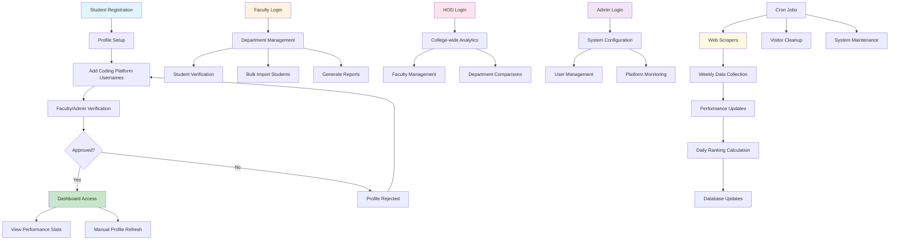
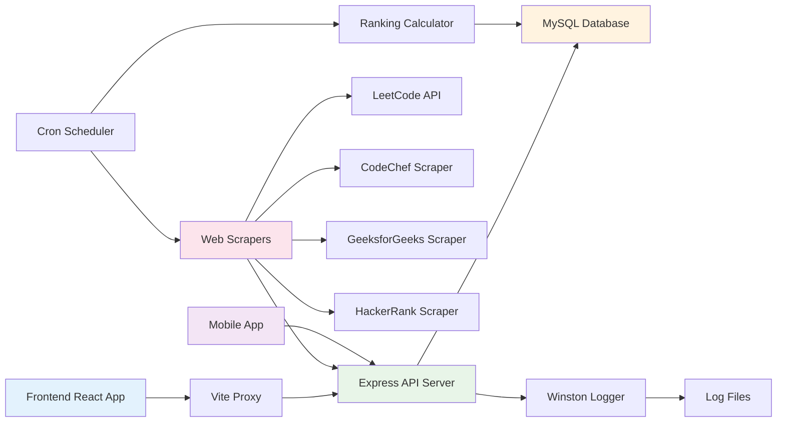

# Code to Win - Unified Coding Platform Dashboard

A comprehensive platform that aggregates coding statistics from multiple programming platforms (LeetCode, CodeChef, GeeksforGeeks, HackerRank, GitHub) into a single dashboard for university placement tracking and student performance monitoring.

## 🎯 Project Overview

Code to Win is designed to help universities track student coding performance across different platforms, providing a unified scoring system for placement preparation and academic assessment. The platform serves multiple user roles including students, faculty, HODs, Deputy HODs, and administrators with advanced analytics, achievement tracking, and comprehensive reporting capabilities.

## 🌟 Highlights

- 🔄 **Automated Scraping** - Weekly automated data collection from 5+ coding platforms
- 📊 **Real-time Analytics** - Live dashboards with KPIs, performance graphs, and system health
- 🏆 **Smart Ranking System** - Configurable scoring with daily rank updates
- 👥 **Multi-Role Support** - Students, Faculty, HOD, Deputy HOD, and Admin dashboards
- 📱 **Cross-Platform** - Web (React) and Mobile (React Native) applications
- 🎯 **Placement Ready** - Advanced filters for placement-eligible students
- 📈 **Comprehensive Reports** - Excel exports, PDF reports, custom data filtering
- 🏅 **Achievement Tracking** - Certificate uploads with faculty verification
- 🔐 **Secure & Scalable** - JWT authentication, role-based access, PM2 process management
- ⚡ **Performance Optimized** - Caching, scheduled tasks, efficient database queries

## 🏗️ Architecture

The project follows a multi-platform architecture:

- **Backend**: Node.js/Express REST API with MySQL database
- **Frontend**: React.js web application with Vite
- **Mobile**: React Native/Expo cross-platform mobile app
- **Database**: MySQL with automated scraping and ranking systems

## 📁 Project Structure

```
code_to_win/
├── backend/           # Node.js API server
│   ├── config/        # Database configuration
│   ├── routes/        # API route handlers
│   │   ├── authRoutes.js         # Authentication
│   │   ├── studentRoutes.js      # Student operations
│   │   ├── facultyRoutes.js      # Faculty operations
│   │   ├── hodRoutes.js          # HOD operations
│   │   ├── adminRoutes.js        # Admin operations
│   │   ├── managementRoutes.js   # User management
│   │   ├── rankingRoutes.js      # Rankings & leaderboards
│   │   ├── achievementRoutes.js  # Achievement system
│   │   ├── analyticsRoutes.js    # Real-time analytics
│   │   ├── exportRoutes.js       # Data export
│   │   ├── downloadRoutes.js     # File downloads
│   │   ├── reportRoutes.js       # Report generation
│   │   ├── contactRoutes.js      # Contact requests
│   │   ├── notificationRoutes.js # Notifications
│   │   └── metaRoutes.js         # Metadata
│   ├── scrapers/      # Platform-specific web scrapers
│   │   ├── leetcode.js
│   │   ├── codechef.js
│   │   ├── geeksforgeeks.js
│   │   ├── hackerrank.js
│   │   ├── github.js
│   │   └── scrapeAndUpdatePerformance.js
│   ├── middleware/    # Authentication & logging
│   │   ├── uploadMiddleware.js   # File uploads
│   │   └── visitorTracker.js     # Visitor tracking
│   ├── migrations/    # Database migrations
│   ├── utils/         # Utility functions
│   │   ├── reportGenerator.js
│   │   └── userValidation.js
│   ├── logs/          # Application logs
│   ├── uploads/       # User-uploaded files
│   │   └── certificates/
│   └── exports/       # Generated export files
├── client/            # React web application
│   ├── src/
│   │   ├── pages/     # Page components
│   │   │   ├── Home.jsx
│   │   │   ├── Login.jsx
│   │   │   ├── Contact.jsx
│   │   │   ├── CheckYourScore.jsx
│   │   │   └── dashboards/
│   │   │       ├── StudentDashboard.jsx
│   │   │       ├── FacultyDashboard.jsx
│   │   │       ├── HeadDashboard.jsx
│   │   │       ├── AdminDashboard.jsx
│   │   │       └── AdminAnalyticsDashboard.jsx
│   │   ├── components/# Reusable UI components
│   │   │   ├── Navbar.jsx
│   │   │   ├── Footer.jsx
│   │   │   ├── Ranking.jsx
│   │   │   ├── ViewProfile.jsx
│   │   │   ├── modals/          # Modal components
│   │   │   └── ui/              # UI components
│   │   ├── context/   # React context providers
│   │   │   ├── AuthContext.jsx
│   │   │   └── MetaContext.jsx
│   │   └── utils/     # Utility functions
│   └── public/        # Static assets
└── mobile/            # React Native mobile app
    ├── src/
    │   ├── screens/   # Mobile screens
    │   ├── components/# Mobile UI components
    │   ├── contexts/  # Mobile context providers
    │   └── navigation/# Navigation configuration
    └── assets/        # Mobile assets
```

## ✨ Key Features

### 🎓 Multi-Role Dashboard System
- **Students**: Personal coding statistics, profile management, platform integration, achievements tracking
- **Faculty**: Department-wise student monitoring, bulk imports, performance tracking, coding profile verification
- **HOD**: College-level analytics, faculty management, comprehensive reports, student oversight
- **Deputy HOD**: Department-specific management with HOD-level privileges
- **Admin**: System-wide management, user verification, platform configuration, advanced analytics

### 📊 Platform Integration
- **LeetCode**: Problems solved (Easy/Medium/Hard), contests participated, badges earned, global ranking
- **CodeChef**: Contest participation, star ratings, problems solved, badges, contest rankings
- **GeeksforGeeks**: Difficulty-wise problem solving (School/Basic/Easy/Medium/Hard), coding score
- **HackerRank**: Star ratings, skill badges, problem-solving statistics
- **GitHub**: Repository statistics, contributions, profile validation

### 🔄 Automated Data Collection
- **Web Scraping**: Automated profile data extraction from coding platforms using Puppeteer
- **Scheduled Updates**: Weekly performance updates (Saturdays at midnight) and daily ranking calculations (3:00 AM)
- **Real-time Refresh**: Manual profile refresh capability for students
- **Error Handling**: Robust retry mechanisms and suspension/reactivation system
- **Visitor Tracking**: Real-time active user monitoring with 5-minute cleanup cycles

### 📈 Scoring & Ranking System
- **Configurable Scoring**: Weighted scoring system based on platform performance
- **University Rankings**: Overall student rankings within the institution
- **Department Rankings**: Department-wise performance comparisons and section-based leaderboards
- **Progress Tracking**: Historical performance monitoring with trending indicators
- **Placement Eligibility**: Advanced filtering system for placement-ready students

### 🏆 Achievement Management
- **Achievement Tracking**: Students can upload certificates and achievements
- **Faculty Verification**: Approval workflow for student-submitted achievements
- **Certificate Storage**: Secure file upload and management system
- **Achievement History**: Comprehensive record of student accomplishments

### 📊 Advanced Analytics & Reporting
- **Real-time KPI Dashboard**: Live statistics on active users, total students, and system health
- **Performance Graphs**: Visual representation of student performance trends
- **Department Comparisons**: Side-by-side department performance analytics
- **Custom Exports**: Advanced Excel export with customizable filters and data points
- **Placement Reports**: Specialized reports for placement eligibility and recruitment
- **Coding Points Reports**: Detailed platform-wise scoring breakdowns

### 🎓 Lifecycle Management
- **Batch Promotion**: Automated year progression for student batches
- **Graduation Processing**: Archive and manage graduated students
- **Section Management**: Dynamic student section assignment and reorganization
- **Faculty Assignment**: Flexible student-faculty assignment system

## ⚡ Quick Start

```bash
# Clone the repository
git clone <repository-url>
cd code_to_win

# Install all dependencies
npm run install-all

# Set up environment variables
cd backend
cp .env.example .env
# Edit .env with your configuration

# Create database
mysql -u root -p
CREATE DATABASE code_to_win;
exit;

# Run migrations
node run_deputy_hod_migration.js
node run_add_rating_migration.js
node run_github_migration.js
node run_add_hackerrank_badges.js

# Start development servers (from root)
cd ..
npm run dev

# Application will be available at:
# Frontend: http://localhost:5173
# Backend: http://localhost:3001
```

## 🚀 Getting Started

### Prerequisites
- Node.js (v16 or higher)
- MySQL (v8.0 or higher)
- npm or yarn package manager
- PM2 (recommended for production)

### Backend Setup

1. **Navigate to backend directory**
   ```bash
   cd backend
   ```

2. **Install dependencies**
   ```bash
   npm install
   ```

3. **Environment Configuration**
   Create a `.env` file with the following variables:
   ```env
   DB_HOST=localhost
   DB_USER=your_mysql_username
   DB_PASS=your_mysql_password
   DB_NAME=code_to_win
   PORT=3001
   JWT_SECRET=your_jwt_secret_key_here
   ```

4. **Database Setup**
   - Create MySQL database:
     ```sql
     CREATE DATABASE code_to_win;
     ```
   - Import the database schema from SQL files
   - Run migrations (if needed):
     ```bash
     node run_deputy_hod_migration.js
     node run_add_rating_migration.js
     node run_add_hackerrank_badges.js
     node run_github_migration.js
     ```

5. **Start the server**
   ```bash
   # Development mode
   npm run dev
   
   # Production mode (with PM2)
   pm2 start server.js --name server -i max
   ```

### Frontend Setup

1. **Navigate to client directory**
   ```bash
   cd client
   ```

2. **Install dependencies**
   ```bash
   npm install
   ```

3. **Start development server**
   ```bash
   npm run dev
   ```

4. **Access the application**
   Open `http://localhost:5173` in your browser

### Mobile App Setup

1. **Navigate to mobile directory**
   ```bash
   cd mobile
   ```

2. **Install dependencies**
   ```bash
   npm install
   ```

3. **Start Expo development server**
   ```bash
   npm start
   ```

4. **Run on device/simulator**
   - For Android: `npm run android`
   - For iOS: `npm run ios`

## 🔧 Configuration

### Grading System
The scoring system is configurable through the database `grading_system` table. Each metric can be assigned different point values:
- LeetCode problems (Easy/Medium/Hard)
- CodeChef contests and star ratings
- GeeksforGeeks problem difficulties (School/Basic/Easy/Medium/Hard)
- HackerRank star ratings and badges
- GitHub contribution metrics

### Scraping Schedule (Automated Cron Jobs)
- **Weekly Profile Updates**: Every Saturday at 00:00 (midnight) - Updates all student coding profiles
- **Daily Rankings**: Every day at 03:00 AM - Recalculates university rankings
- **Visitor Cleanup**: Every 5 minutes - Removes inactive visitor sessions
- **Manual Refresh**: Available to students for immediate updates (rate-limited)

### Database Migrations
Available migrations in `backend/migrations/`:
- `add_deputy_hod_support.sql` - Adds Deputy HOD role support
- `add_rating_columns.sql` - Adds rating columns for platforms
- `add_hackerrank_badges_column.sql` - Adds HackerRank badges support
- `fix_achievements_schema.sql` - Achievement system schema
- `fix_achievements_unique_constraint.sql` - Achievement constraints

Run migrations using the corresponding scripts in the backend folder.

## 💾 Database Schema Overview

### Core Tables
- **users** - Central authentication table (students, faculty, HODs, admins)
- **student_profiles** - Student personal information and academic details
- **faculty_profiles** - Faculty information and department assignments
- **hod_profiles** - HOD and Deputy HOD information
- **admin_profiles** - Administrator details

### Coding Platform Data
- **coding_profiles** - Student coding platform usernames and verification status
- **leetcode_stats** - LeetCode performance metrics
- **codechef_stats** - CodeChef performance and contest data
- **geeksforgeeks_stats** - GeeksforGeeks problem-solving statistics
- **hackerrank_stats** - HackerRank ratings and badges
- **github_stats** - GitHub profile and contribution data

### System Tables
- **grading_system** - Configurable point values for different metrics
- **rankings** - Computed student rankings (updated daily)
- **achievements** - Student achievements and certificates
- **notifications** - System notifications for all users
- **contact_requests** - User contact/support requests
- **visitor_sessions** - Real-time visitor tracking
- **departments** - Academic departments/branches
- **years** - Academic year configurations
- **sections** - Section/class divisions

### Relationships
- Students belong to departments, years, and sections
- Faculty are assigned to departments
- HODs and Deputy HODs manage specific departments
- Students have one coding profile with multiple platform stats
- Rankings are calculated based on coding stats and grading system

## 📱 User Workflows

### Student Journey
1. **Registration**: Create account with university credentials
2. **Profile Setup**: Add coding platform usernames (LeetCode, CodeChef, GeeksforGeeks, HackerRank, GitHub)
3. **Verification**: Wait for faculty/admin approval of coding profiles
4. **Dashboard Access**: View unified statistics, rankings, and performance metrics
5. **Profile Management**: Update platform usernames and personal information
6. **Achievements**: Upload certificates and achievements for verification
7. **Score Checking**: Use "Check Your Score" feature to preview performance
8. **Manual Refresh**: Trigger immediate profile refresh (rate-limited)

### Faculty Management
1. **Student Oversight**: Monitor department student performance with filters
2. **Profile Verification**: Approve or reject student coding profile requests
3. **Bulk Operations**: Import student data via Excel files
4. **Achievement Verification**: Review and approve student-submitted achievements
5. **Analytics**: Generate department-wise reports and performance analytics
6. **Student Assignment**: Manage faculty-student relationships

### HOD & Deputy HOD Administration
1. **Department Analytics**: Comprehensive department performance overview
2. **Faculty Management**: Monitor and manage department faculty members
3. **Student Management**: Full CRUD operations on student records
4. **Batch Operations**: Promote batches, manage graduations
5. **Assignment Control**: Assign faculty to specific student groups
6. **Reporting**: Generate advanced reports for placement and performance

### Administrative Control
1. **System Management**: Configure scoring parameters and grading system
2. **User Management**: Manage students, faculty, HODs, Deputy HODs, and admins
3. **Platform Monitoring**: Oversee scraping operations and system health
4. **Data Export**: Generate comprehensive reports with custom filters
5. **Settings Configuration**: Manage verification requirements and batch configurations
6. **Placement Management**: Filter and export placement-eligible students
7. **Contact Requests**: Review and respond to user inquiries
8. **Real-time Analytics**: Monitor active users and system performance

## 🔄 System Workflow Diagram



### Data Flow Architecture



## 🛠️ API Endpoints

### Authentication (`/api/auth`)
- `POST /login` - User authentication
- `POST /register` - New user registration
- `GET /validate` - Validate JWT token
- `POST /reset-password` - Password reset request
- `PUT /update-password` - Update user password

### Student Operations (`/api/student`)
- `GET /profile` - Fetch student profile and performance
- `PUT /update-profile` - Update personal information
- `POST /coding-profile` - Submit coding platform usernames
- `POST /refresh-coding-profiles` - Manual performance refresh
- `PUT /change-password` - Change student password
- `GET /notifications` - Get student notifications

### Faculty Operations (`/api/faculty`)
- `GET /profile` - Get faculty profile
- `PUT /profile` - Update faculty profile
- `GET /students` - Get department students
- `POST /verify-coding-profile` - Approve/reject coding profiles
- `GET /coding-profile-requests` - Get pending profile verifications
- `GET /notifications` - Get faculty notifications

### HOD Operations (`/api/hod`)
- `GET /profile` - Get HOD profile
- `PUT /profile` - Update HOD profile
- `GET /students` - Get all department students with filters
- `GET /faculty` - Get department faculty members
- `POST /assign-faculty` - Assign faculty to students
- `POST /update-student` - Update student information
- `DELETE /students/:id` - Delete student record

### Admin Operations (`/api/admin`)
- `GET /profile` - Get admin profile
- `PUT /profile` - Update admin profile
- `GET /students` - Get all students with filters
- `GET /faculty` - Get all faculty members
- `GET /hods` - Get all HODs and Deputy HODs
- `GET /admins` - Get all admin users
- `POST /admins` - Add new admin
- `PUT /admins/:id` - Update admin
- `DELETE /admins/:id` - Delete admin
- `PUT /faculty/:id` - Update faculty information
- `DELETE /faculty/:id` - Delete faculty
- `PUT /hods/:id` - Update HOD information
- `DELETE /hods/:id` - Delete HOD
- `POST /update-student` - Update student details
- `GET /settings` - Get system settings
- `POST /toggle-verification` - Toggle verification requirements
- `GET /batch-configs` - Get batch configurations
- `POST /batch-configs` - Update batch configurations
- `POST /placement-eligibility` - Filter placement-eligible students

### Management Operations (`/api`)
- `POST /add-branch` - Add new department/branch
- `POST /add-student` - Add individual student
- `POST /add-faculty` - Add individual faculty
- `POST /add-hod` - Add new HOD
- `POST /add-deputy-hod` - Add new Deputy HOD
- `POST /reset-password` - Reset user password
- `POST /delete-user` - Delete user account
- `POST /bulk-import-student` - Bulk import students via Excel
- `POST /bulk-import-faculty` - Bulk import faculty via Excel
- `POST /bulk-import-with-cp` - Bulk import students with coding profiles
- `POST /check-score` - Check student score by roll number
- `POST /promote-batch` - Promote batch to next year
- `POST /graduate-batch` - Graduate and archive batch

### Rankings & Analytics (`/api/ranking`)
- `GET /overall` - University-wide rankings with filters
- `GET /filter` - Advanced filtered rankings
- `GET /section` - Section-based rankings
- `POST /update-all` - Trigger manual ranking update

### Analytics (`/api/admin/analytics`)
- `GET /realtime-kpi` - Real-time key performance indicators
- `GET /performance-graph` - Performance trend graphs
- `GET /system-health` - System health metrics

### Export & Download (`/api/export`, `/api/download`)
- `GET /export/students-excel` - Export students to Excel
- `GET /export/files` - List available export files
- `GET /export/download/:filename` - Download export file
- `POST /export/placement-excel` - Generate placement report
- `GET /download/all-students` - Download all student data
- `GET /download/faculty` - Download faculty data
- `GET /download/hod` - Download HOD data
- `GET /download/department-wise` - Download department-wise data
- `GET /download/custom` - Custom filtered download

### Reports (`/api/reports`)
- `GET /coding-points` - Generate coding points report

### Achievements (`/api/achievements`)
- `POST /add` - Add new achievement (with file upload)
- `GET /my-achievements` - Get student's achievements
- `GET /pending` - Get pending achievement approvals
- `DELETE /:id` - Delete achievement

### Contact (`/api/contact`)
- `POST /` - Submit contact request
- `GET /` - Get all contact requests (admin)
- `PUT /:id` - Update contact request status

### Metadata (`/api/meta`)
- `GET /grading` - Get grading system configuration
- `PUT /grading/:metric` - Update grading metric
- `GET /depts` - Get all departments
- `GET /years` - Get all academic years
- `GET /sections` - Get all sections

### Notifications (`/api/notifications`)
- `PUT /:id/read` - Mark notification as read
- `DELETE /clear` - Clear all notifications

## 🔒 Security Features

- **JWT Authentication**: Secure token-based authentication with expiration
- **Role-based Access Control (RBAC)**: Granular permissions for each user type
- **Password Hashing**: bcryptjs with salt rounds for secure password storage
- **Input Validation**: Comprehensive request validation and sanitization
- **SQL Injection Protection**: Parameterized queries with mysql2
- **Rate Limiting**: API rate limiting for scraping and sensitive operations
- **File Upload Security**: File type validation and secure storage for certificates
- **CORS Configuration**: Controlled cross-origin resource sharing
- **Environment Variables**: Sensitive data protected via .env files
- **Session Management**: Secure session handling and timeout mechanisms
- **Visitor Tracking**: Activity monitoring without PII collection

## 📈 Project Statistics

- **5+ Coding Platforms** integrated (LeetCode, CodeChef, GeeksforGeeks, HackerRank, GitHub)
- **87+ API Endpoints** across 14 route modules
- **Multi-platform support** - Web, Mobile (iOS & Android)
- **4 User Roles** with distinct permissions and dashboards
- **Automated cron jobs** for weekly scraping and daily ranking updates
- **Real-time visitor tracking** with automatic cleanup
- **Achievement management** with file uploads and verification workflow
- **Advanced filtering** for placement eligibility and custom exports
- **Comprehensive logging** with Winston for debugging and monitoring

## 📊 Monitoring & Logging

- **Winston Logging**: Comprehensive application logging with file rotation
  - Error logs: `backend/logs/error.log`
  - Combined logs: `backend/logs/combined.log`
  - Console output in development mode
- **Error Tracking**: Detailed error logs with stack traces and context
- **Performance Monitoring**: Scraping operation success/failure tracking
- **User Activity**: Authentication, profile updates, and critical operations logging
- **System Health**: Real-time KPI dashboard with active users and system metrics
- **Visitor Tracking**: Active session monitoring with automatic cleanup
- **PM2 Monitoring**: Process management and health monitoring via PM2
  ```bash
  pm2 monit          # Real-time monitoring
  pm2 logs server    # View application logs
  pm2 status         # Check process status
  ```

## 🚀 Deployment

### Production Environment
1. **Database**: Set up production MySQL instance with proper security
2. **Backend**: Deploy Node.js application using PM2 for process management
   ```bash
   # Install PM2 globally
   npm install -g pm2
   
   # Start server in cluster mode
   cd backend
   pm2 start server.js --name server -i max
   
   # Save PM2 configuration
   pm2 save
   
   # Setup PM2 to start on system boot
   pm2 startup
   
   # Monitor processes
   pm2 monit
   
   # View logs
   pm2 logs server
   ```

3. **Frontend**: Build and deploy static files
   ```bash
   cd client
   npm run build
   # Deploy dist/ folder to web server (Nginx/Apache)
   ```

4. **Mobile**: Build and distribute via app stores
   ```bash
   cd mobile
   # Android build
   eas build --platform android
   # iOS build
   eas build --platform ios
   ```

### Environment Variables
Ensure all production environment variables are properly configured:
- Database credentials (DB_HOST, DB_USER, DB_PASS, DB_NAME)
- JWT secrets (JWT_SECRET)
- Server port (PORT, default: 3001)
- Logging levels and paths
- API rate limits
- File upload paths

### Nginx Configuration (Optional)
```nginx
server {
    listen 80;
    server_name your-domain.com;
    
    # Frontend
    location / {
        root /path/to/client/dist;
        try_files $uri $uri/ /index.html;
    }
    
    # Backend API
    location /api {
        proxy_pass http://localhost:3001;
        proxy_http_version 1.1;
        proxy_set_header Upgrade $http_upgrade;
        proxy_set_header Connection 'upgrade';
        proxy_set_header Host $host;
        proxy_cache_bypass $http_upgrade;
    }
    
    # Uploaded files
    location /uploads {
        alias /path/to/backend/uploads;
    }
}
```

### Security Considerations
- Enable HTTPS/SSL certificates (Let's Encrypt recommended)
- Configure firewall rules (UFW/iptables)
- Set proper file permissions for uploads directory
- Regular database backups
- Environment variable protection (.env not in version control)
- CORS configuration for production domains
- Rate limiting on sensitive endpoints

## 🤝 Contributing

We welcome contributions! Here's how you can help:

### Development Workflow
1. Fork the repository
2. Create a feature branch (`git checkout -b feature/amazing-feature`)
3. Make your changes and test thoroughly
4. Commit your changes (`git commit -m 'Add amazing feature'`)
5. Push to the branch (`git push origin feature/amazing-feature`)
6. Open a Pull Request

### Contribution Guidelines
- Follow existing code style and conventions
- Write clear, descriptive commit messages
- Add comments for complex logic
- Update documentation as needed
- Test your changes before submitting
- Ensure no breaking changes to existing features
- Update CHANGELOG.md with your changes

### Areas for Contribution
- 🐛 Bug fixes and error handling improvements
- ✨ New features and enhancements
- 📝 Documentation improvements
- 🎨 UI/UX improvements
- ⚡ Performance optimizations
- 🧪 Test coverage expansion
- 🌍 Internationalization support
- 🔒 Security enhancements

## 📄 License

This project is licensed under the ISC License - see the LICENSE file for details.

## 🔧 Troubleshooting

### Common Issues

**Database Connection Errors**
- Verify MySQL is running: `sudo systemctl status mysql`
- Check `.env` file credentials
- Ensure database exists: `CREATE DATABASE code_to_win;`

**Scraping Failures**
- Check platform availability and network connectivity
- Verify student usernames are correct
- Check logs: `backend/logs/error.log`
- Platform websites may have changed structure (update scrapers)

**Port Already in Use**
- Change PORT in `.env` file
- Kill existing process: `lsof -ti:3001 | xargs kill -9`

**Migration Errors**
- Run migrations in order
- Check database permissions
- Verify column doesn't already exist before running migration

**PM2 Issues**
```bash
pm2 kill              # Stop all PM2 processes
pm2 flush             # Clear logs
pm2 restart all       # Restart all processes
```

**Build Errors**
```bash
# Clear node modules and reinstall
rm -rf node_modules package-lock.json
npm install

# Clear build cache
rm -rf dist/ .vite/
```

### Logs Location
- Backend logs: `backend/logs/`
- PM2 logs: `~/.pm2/logs/`
- Error logs: `backend/logs/error.log`
- Combined logs: `backend/logs/combined.log`

## 🆘 Support

For support and questions:
- Create an issue in the repository
- Contact the development team
- Check the logs directory for troubleshooting information
- Review documentation in `METHODOLOGY.md` and `CODE_SNIPPETS.md`
- Use `/api/contact` endpoint for system-specific queries

## 🔮 Future Enhancements

- **Additional Platforms**: Integration with Codeforces, AtCoder, TopCoder
- **Advanced Analytics**: Machine learning-based performance predictions and trend analysis
- **Mobile Features**: Push notifications, offline mode, biometric authentication
- **Gamification**: Enhanced achievement badges, streak tracking, leaderboard challenges
- **API Integration**: Direct platform APIs instead of web scraping (where available)
- **Real-time Updates**: WebSocket-based live ranking updates
- **Email Notifications**: Automated email alerts for profile verifications and updates
- **Advanced Reporting**: PDF report generation with charts and visualizations
- **Student Portfolio**: Auto-generated coding portfolio pages
- **Contest Tracking**: Live contest participation tracking and reminders
- **Peer Comparison**: Compare performance with peers and batch mates
- **Faculty Dashboard Enhancements**: More granular student monitoring tools
- **API Rate Limiting**: Enhanced rate limiting and caching mechanisms
- **Dark Mode**: Full dark mode support across web and mobile
- **Multi-language Support**: Internationalization (i18n) support

## 🛠️ Tech Stack

### Backend
- **Runtime**: Node.js v16+
- **Framework**: Express.js v5
- **Database**: MySQL v8.0 with mysql2 driver
- **Authentication**: JWT (jsonwebtoken)
- **Logging**: Winston
- **Task Scheduling**: node-cron
- **Web Scraping**: Puppeteer, Playwright, Cheerio
- **File Processing**: ExcelJS, Multer, XLSX
- **Password Hashing**: bcryptjs
- **Process Manager**: PM2 (production)

### Frontend (Web)
- **Framework**: React v19
- **Build Tool**: Vite v6
- **Styling**: Tailwind CSS v4
- **Routing**: React Router DOM v7
- **State Management**: React Context API
- **Data Fetching**: TanStack Query (React Query)
- **Charts**: Recharts
- **Forms**: React Hook Form
- **Notifications**: React Hot Toast
- **Icons**: React Icons
- **Animations**: Framer Motion, AOS
- **PDF Generation**: @react-pdf/renderer
- **Excel Export**: XLSX

### Mobile
- **Framework**: React Native
- **Build System**: Expo
- **Styling**: NativeWind (Tailwind for React Native)
- **Language**: JavaScript/TypeScript

### Development Tools
- **Version Control**: Git
- **Linting**: ESLint
- **API Testing**: Postman/Thunder Client
- **Package Manager**: npm
- **Concurrent Tasks**: concurrently

## 📋 Available Scripts

### Root Level
```bash
npm run dev              # Run both backend and frontend concurrently
npm run server           # Run backend only
npm run client           # Run frontend only
npm run install-all      # Install dependencies for all projects
```

### Backend
```bash
npm run dev              # Start backend with nodemon
npm run generate-excel   # Generate student Excel export
npm run update-rankings  # Manually update rankings
```

### Frontend
```bash
npm run dev              # Start Vite dev server
npm run build            # Build for production
npm run preview          # Preview production build
npm run lint             # Run ESLint
```

### Mobile
```bash
npm start                # Start Expo dev server
npm run android          # Run on Android device/emulator
npm run ios              # Run on iOS device/simulator
```

## 🤝 Contributing

We welcome contributions! Here's how you can help:

### Development Workflow
1. Fork the repository
2. Create a feature branch (`git checkout -b feature/amazing-feature`)
3. Make your changes and test thoroughly
4. Commit your changes (`git commit -m 'Add amazing feature'`)
5. Push to the branch (`git push origin feature/amazing-feature`)
6. Open a Pull Request

### Contribution Guidelines
- Follow existing code style and conventions
- Write clear, descriptive commit messages
- Add comments for complex logic
- Update documentation as needed
- Test your changes before submitting
- Ensure no breaking changes to existing features

### Areas for Contribution
- 🐛 Bug fixes and error handling improvements
- ✨ New features and enhancements
- 📝 Documentation improvements
- 🎨 UI/UX improvements
- ⚡ Performance optimizations
- 🧪 Test coverage expansion
- 🌍 Internationalization support
- 🔒 Security enhancements

## 🔧 Troubleshooting

### Common Issues

**Database Connection Errors**
- Verify MySQL is running: `sudo systemctl status mysql`
- Check `.env` file credentials
- Ensure database exists: `CREATE DATABASE code_to_win;`

**Scraping Failures**
- Check platform availability and network connectivity
- Verify student usernames are correct
- Check logs: `backend/logs/error.log`
- Platform websites may have changed structure (update scrapers)

**Port Already in Use**
- Change PORT in `.env` file
- Kill existing process: `lsof -ti:3001 | xargs kill -9`

**Migration Errors**
- Run migrations in order
- Check database permissions
- Verify column doesn't already exist before running migration

**PM2 Issues**
```bash
pm2 kill              # Stop all PM2 processes
pm2 flush             # Clear logs
pm2 restart all       # Restart all processes
```

**Build Errors**
```bash
# Clear node modules and reinstall
rm -rf node_modules package-lock.json
npm install

# Clear build cache
rm -rf dist/ .vite/
```

### Logs Location
- Backend logs: `backend/logs/`
- PM2 logs: `~/.pm2/logs/`
- Error logs: `backend/logs/error.log`
- Combined logs: `backend/logs/combined.log`

## 📄 License

This project is licensed under the ISC License.

## 👥 Authors & Acknowledgments

**Developed for university coding communities to excel in placement preparation.**

### Technologies & Libraries
Special thanks to the open-source community for these amazing tools:
- React, React Native, Express.js, MySQL
- Puppeteer & Playwright for web scraping
- Winston for logging, PM2 for process management
- Recharts, Framer Motion, Tailwind CSS
- And many more listed in package.json files

### Platform Credits
Data sourced from:
- LeetCode - leetcode.com
- CodeChef - codechef.com
- GeeksforGeeks - geeksforgeeks.org
- HackerRank - hackerrank.com
- GitHub - github.com

## 🆘 Support

For support and questions:
- 📧 Create an issue in the repository
- 💬 Contact the development team
- 📋 Check the logs directory: `backend/logs/`
- 📚 Review documentation in `METHODOLOGY.md` and `CODE_SNIPPETS.md`
- 🌐 Use `/api/contact` endpoint for system-specific queries

## 📞 Contact

For inquiries about the platform:
- Use the built-in contact form at `/contact`
- Check system logs for troubleshooting
- Review API documentation above
- Submit issues via GitHub repository

---

**Built with ❤️ for university coding communities**

*Empowering students to track, improve, and showcase their coding skills across multiple platforms.*